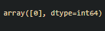

# Implementation of Decision Tree Classifier Model for Predicting Employee Churn
## AIM:
To write a program to implement the Decision Tree Classifier Model for Predicting Employee Churn.
## Equipments Required:
1. Hardware – PCs
2. Anaconda – Python 3.7 Installation / Moodle-Code Runner
## Algorithm
1. Import pandas to read the csv files.
2. Display the head and tail of the dataset.
3. Import LabelEncoder() from sklearn.preprocessing.
4. Label the data which are not in the integer type. 
5. Assign the X and Y from the dataset.
6. Split the dataset using train_test_split from sklearn.model_selection.
7. Import DecisionTreeClassifier from sklearn.tree
8. Fit the Training set in a variable.
9. Import metrics from sklearn to find the accuracy.
10. Predict the result for the given values.
## Program:
```
Program to implement the Decision Tree Classifier Model for Predicting Employee Churn.
Developed by: Sai Darshan G
RegisterNumber:  212221240047
import pandas as pd
data=pd.read_csv("Employee.csv")
data.head()
data.info()
data.isnull().sum()
data["left"].value_counts()
from sklearn.preprocessing import LabelEncoder
le=LabelEncoder()
data["salary"]=le.fit_transform(data["salary"])
data.head()
x=data[["satisfaction_level","last_evaluation","number_project","average_montly_hours","time_spend_company","Work_accident","promotion_last_5years","salary"]]
x.head()
y=data["left"]
from sklearn.model_selection import train_test_split
X_train,X_test,Y_train,Y_test=train_test_split(x,y,test_size=0.2,random_state=100)
from sklearn.tree import DecisionTreeClassifier
dt=DecisionTreeClassifier(criterion="entropy")
dt.fit(X_train,Y_train)
y_pred=dt.predict(X_test)
from sklearn import metrics
accuracy=metrics.accuracy_score(Y_test,y_pred)
accuracy
dt.predict([[0.5,0.8,9,260,6,0,1,2]])
```
## Output:

## Result:
Thus the program to implement the  Decision Tree Classifier Model for Predicting Employee Churn is written and verified using python programming.
